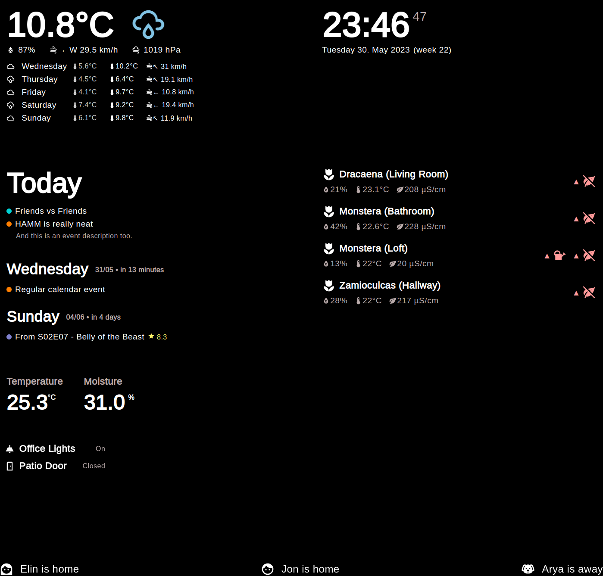

# HAMM (Home Assistant Magic Mirror)

### Vite + Svelte application bundled with Electron to to display [Home Assistant](https://home-assistant.io) entities in a magic mirror like fashion.



## Getting started
### This assumes you have a raspberry pi running with a desktop environment.
1. Download the [latest release](https://github.com/jonkristian/hamm/releases/latest) and install with `sudo dpki -i hamm-{version}.deb`.
2. Copy contents of `resources/hamm.service` to `/etc/systemd/system/hamm.service` and type `sudo systemctl enable hamm`
3. Create A Long-Lived Access Token for hamm in Home Assistant under profile.
4. Copy content of `resources/config.json` and `resources/cards.json` to `~/.config/hamm`
5. Modify `config.json` with your token and url, and `cards.json` with your own config.
6. Reboot

## Working with it
The contents of the example `resources/config.json` is mandatory, language support is `en` or `nb` for now. Just start editing `cards.json`, and look below for options. 

PS: In most cases the app should auto-refresh, if not there could be a bug, if you know how to get som console logs from developer tools, I'd appreciate if you create a new ticket with the logs included.

### Base Card Options (Mandatory for all  cards)
| Option    |  Description |
| -         |- |
| component | There are several card components available for you. `DateTime`, `Weather`, `Calendar`, `Entities`, `Glance`, `Person` and `Plants`.
| placement |  Where in the view the card should be placed, it will be placed following your cards.json structure. `upper-left`, `upper-right`, `middle-left`, `middle-right`. You can use `bottom` to stick the content to the bottom, it will line up items horizontally.

### Card Types
Basic structure of a card looks like this:
```
"weather":{
  "component":"WeatherCard",
  "placement":"upper-left",
  "entity_id":"weather.home",
  "show_forecast":true
}
```
Cards with multiple entities are structured like this:
```
"overview": {
  "component":"EntityCard",
  "placement":"middle-left",
  "entities": [
    {
      "entity_id":"light.office_downlights",
      "title":"Office Downlights"
    },
    {
      "entity_id":"binary_sensor.loft_sliding_door",
      "icon":"mdi-door",
      "state_true":"Open",
      "state_false":"Closed"
    }
  ]
},
```

| Component   | Entity/Entities          | Options                           | Description
| -           |-                  |-                                           | -
| `DateTime`  | `none`            | `show_seconds`(bool)                       | A clock w/wout seconds.
| `Weather`   | `weather.*`       | `show_forecast`(bool)                      | Weather w/wout forecast.
| `Calendar`  | `calendar.*` List | `days`(int), `color`, `show_description`   | `days`=amount of days to show. `color`=hex format. `show_description`=two strings `all` or `next`
| `Entities`  | `entities` List   |                                            | Shows a simple list with entities and their state.
| `Glance`    | `entities` List   | `columns` (int)                            | Vertically arranged title/state in columns.
| `Person`    | `person:.*`       |                                            | Basic person card with current location.
| `Plants`    | `entities` List   | `display_brightness` (bool)                | Displays a list of plants with statuses.

### Bonus
If you're using my [Media Tracker](https://github.com/jonkristian/mediatracker-ha) integration, the calendar also supports that.


Hope you found this little project useful, please let me know if you like it and you're welcome to create a ticket if you feel something is missing or if you're having any issues.

***
⭐️ this repository if you found it useful ❤️

<a href="https://www.buymeacoffee.com/jonkristian" target="_blank"></a>
