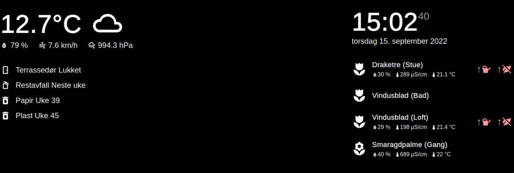

# HAMM (Home Assistant Magic Mirror)



A simple vite + svelte application to display [Home Assistant](https://home-assistant.io) entities in a magic mirror like fashion. It connects to Home Assistant through websockets.

## Setting it up
Clone this repository and then inside run `npm install`. Then copy `.env-example` to `.env` and modify it with your home assistant url and a long lived token (generated via your account in home assistant).

## Working with it
Start by creating a file called `cards.js` inside the `src` folder, then copy the contents from `./src/cards.js-example`, naturally you will now have to edit and replace with your own entities. For a live preview while you're happily editing you can simply run `npm run dev` in your terminal, the output will give you a localhost url for the live preview.

## Setting it up (Raspberry Pi)
I am using pm2 to start and stop the server, install it with `sudo npm install -g pm2` and make sure it it starts on boot by following instructions from the `pm2 startup` command.

Next up, clone this repository to your pi and install it with `npm install`, then create a file called `hamm.sh` with the following content:
```
cd ./hamm
DISPLAY=:0 npm run preview
```

Then start hamm through pm2 by issuing `pm2 start hamm.sh`. and save it with `pm2 save`. You can now control hamm with `pm2 restart|stop|logs|show hamm`.

Copy `kiosk.sh` to your home folder on the pi, then `chmod +x kiosk.sh`. 

Edit `~/.config/lxsession/LXDE-pi/autostart` and add the following:
```
@xset s noblank
@xset s off
@xset -dpms
@bash /home/pi/kiosk.sh
```


***
⭐️ this repository if you found it useful ❤️

<a href="https://www.buymeacoffee.com/jonkristian" target="_blank"></a>
